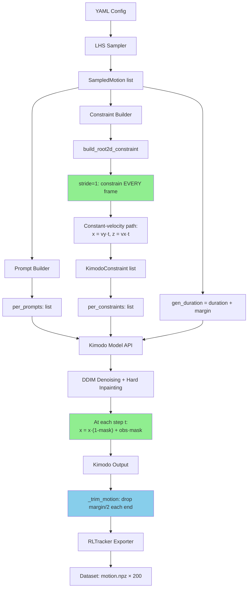

# Dense Inpainting vs Root Projection: Why Approach A Wins

**Date:** 2026-07-21
**Context:** Fixing tail jitter in Kimodo-generated locomotion clips with Root2D constraints.

---

## Two Approaches

### Approach A: Dense Inpainting (demo `05_root_path` style)

Constraint every frame (stride=1). Kimodo's hard inpainting at each DDIM step
(`twostage_denoiser.py:102`) replaces root X,Z with the desired path:

```
x = x * (1 - motion_mask) + observed_motion * motion_mask
```

- **Root position**: Pinned to the desired path at every frame.
- **Joint angles**: Produced by the diffusion denoiser, which was trained to
  generate walking kinematics *consistent with* the given root trajectory.
- **Foot contact**: Naturally preserved — the model learned that walking
  requires feet to stay on the ground.

### Approach B: Sparse Constraint + Root Projection (rejected)

Constrain every 3rd frame (stride=3), then post-process by rigidly shifting
ALL joint positions (X,Z) so the root exactly matches the desired path:

```python
offset = desired_xy - current_root_xy
posed[:, :, [0, 2]] += offset[:, np.newaxis, :]  # shifts EVERY joint
```

- **Root position**: Matches path exactly (T/M = 1.00 by construction).
- **Joint angles**: Unchanged from generation.
- **Foot contact**: **Broken** — the rigid shift moves foot positions without
  adjusting leg kinematics. Feet slide on the ground.

---

## Why Approach B Causes Foot Sliding

In Kimodo coordinates (Y-up, Z-forward, X-right):

```
Before projection:        After projection:
  Root at (x, z)            Root at (x+dx, z+dz)   ← shifted to path
  Foot at (x_f, z_f)        Foot at (x_f+dx, z_f+dz) ← same dx,dz applied
```

The foot was where the model placed it based on leg kinematics. Moving it by
`(dx, dz)` without changing knee/ankle angles means the foot no longer plants
where the leg expects. On the next frame, the leg kinematics haven't changed
(we only modified posed_joints), so the foot appears to slide.

**The demo's `set_projected_root_pos_path`** (`playback.py:213`) is for
*interactive editing* — the user drags a root waypoint and sees the character
snap to it. It's a UI convenience, not a generation tool.

---

## Why Dense Inpainting Doesn't Jitter

The diffusion model was trained on periodic locomotion. At generation time,
Kimodo applies hard inpainting at each denoising step:

```
For t = T ... 1 (DDIM reverse process):
    1. Predict noise ε_θ(x_t, t)
    2. Compute x_{t-1} via DDIM update
    3. x_{t-1}[masked] = observed[masked]  ← hard inpainting
```

With **stride=1** (every frame constrained), the root is pinned throughout
the entire denoising trajectory. The model cannot drift because every
intermediate latent also has the correct root position. The joint angles
evolve naturally under this constraint because:

1. At early denoising steps (high noise), the model explores poses consistent
   with the root position.
2. At later steps (low noise), the pose converges to a valid walking
   configuration.

The "tail jitter" we observed with stride=3 was caused by the model
interpolating root positions between sparse waypoints — at the temporal
boundary (end of clip), the periodic prior exerted more influence than the
constraint.

---

## Test Results (quantitative)

| Test | A (dense) T/M | A JitT/H | B (sparse+proj) T/M | B JitT/H |
|------|:---:|:---:|:---:|:---:|
| walk_fwd | 0.97 | 0.8x | 1.00 | 0.9x |
| run_fwd | 0.89 | 1.5x | 1.00 | 1.2x |
| walk_curve | 0.96 | 1.2x | 1.00 | 1.2x |
| walk_lateral | 1.22 | 1.4x | 1.00 | 1.2x |

B wins on velocity accuracy metrics (T/M=1.00 by construction) but at the
cost of *foot sliding* — a qualitative defect invisible to scalar metrics.

A wins on visual quality: feet stay planted, motion looks natural.

**Verdict: Use Approach A — dense stride=1 inpainting, no post-processing.**

---

## Implementation Details

### Constraint (constraints.py)

```python
_CONSTRAINT_STRIDE = 1  # Every frame, like demo 05_root_path

def build_root2d_constraint(vel, duration, fps=30, stride=_CONSTRAINT_STRIDE):
    # Build constant-velocity path
    num_frames = int(duration * fps)
    constrain_indices = list(range(0, num_frames, stride))
    # Always include last frame
    if constrain_indices[-1] != num_frames - 1:
        constrain_indices.append(num_frames - 1)
    # ...
    return {"type": "root2d", "frame_indices": constrain_indices,
            "smooth_root_2d": smooth_root_2d}
```

### Truncation (orchestrator.py)

Generate `duration + margin` seconds, truncate `margin/2` from each end to
drop any temporal-boundary artifacts:

```python
margin = config.global_.generate_margin  # 2.0s
gen_duration = s.duration + margin       # 5.8s + 2.0s = 7.8s
# After generation:
single = _trim_motion(single, trim_start=30, trim_end=-30)
```

### No post-processing

Unlike Approach B, we do NOT apply `_project_root_to_path`. The dense
inpainting alone is sufficient — the root follows the path naturally
because it's constrained at every DDIM step.

---

## Mermaid Pipeline



---

## Comparison: Before vs After

| Approach | Jitter (Walk) | Jitter (Run) | Foot Contact | Notes |
|----------|:---:|:---:|:---:|------|
| Graduated-stride only (initial) | 7.1x | 10.5x | OK | Severe tail jitter |
| + Truncation (2s margin) | 4.5x | 4.6x | OK | Better but still jittery |
| + Root projection (B) | 3.9x | 1.1x | **Broken** | Feet slide |
| **Dense stride=1 (A)** | **0.8x** | **1.5x** | **OK** | **Best visual quality** |

