# G1 Locomotion Fine-Grained Motion Generation — Development Report

**Date**: 2026-07-20
**Author**: Kimodo G1 Locomotion Framework

---

## Pipeline Overview

```mermaid
flowchart TB
    subgraph CONFIG["1. Configuration (YAML)"]
        CFG[g1_normal_loco.yaml]
        RANGES["vx: [-0.6, 0.8]<br/>vy: [-0.4, 0.4]<br/>wz: [-0.5, 0.5]<br/>duration: [5.0, 8.0]<br/>torso_height: [0.6, 0.85]"]
        STYLES["styles: [normally, steady pace]<br/>description: a robot walks"]
    end

    subgraph SAMPLE["2. LHS Sampler"]
        LHS["Latin Hypercube Sampling<br/>───<br/>Divide each of D=5 dimensions into N=50 strata<br/>Draw one sample per stratum with random jitter<br/>→ uniform coverage with minimal gaps"]
        SAMP_OUT["SampledMotion × 50<br/>───<br/>duration: 5.0–8.0s<br/>vx/vy/wz: per-sample unique<br/>torso_height: per-sample unique<br/>style: randomly selected"]
    end

    subgraph PROMPT["3. Prompt Builder"]
        PROMPT_IN["description + style + vel + torso"]
        PROMPT_QUAL["Qualitative mapping<br/>───<br/>|vx| < 0.05 → 'very slowly'<br/>|vx| < 0.30 → 'slowly'<br/>|vx| < 0.70 → ''<br/>|vx| < 1.50 → 'at a brisk pace'<br/>|vx| ≥ 1.50 → 'at high speed'<br/>───<br/>height < 0.50 → 'crouching very low'<br/>height < 0.60 → 'crouching'<br/>..."]
        PROMPT_OUT["'a robot walks at a brisk pace normally slightly crouching.'"]
    end

    subgraph CONST["4. Constraint Builder"]
        CONST_IN["SampledMotion.vel {vx, vy, wz} + duration"]
        CONST_STRAIGHT["Straight path (|wz| ≈ 0)<br/>───<br/>θ₀ = atan2(vy, vx)<br/>X(t) = vy · t<br/>Z(t) = vx · t"]
        CONST_CURVED["Curved path (|wz| > 0)<br/>───<br/>θ(t) = θ₀ + wz·t<br/>vX(t) = vy·cos θ + vx·sin θ<br/>vZ(t) = vx·cos θ − vy·sin θ<br/>X(t) = Σ vX·dt<br/>Z(t) = Σ vZ·dt"]
        CONST_SPARSE["Sparse frame selection<br/>───<br/>stride = 3<br/>constrain every 3rd frame<br/>+ always first & last frame<br/>→ ~34% coverage"]
        CONST_OUT["Root2D constraint dict<br/>───<br/>{<br/>  type: 'root2d',<br/>  frame_indices: [0,3,6,...,N-1],<br/>  smooth_root_2d: [[X₀,Z₀],...],<br/>  global_root_heading: [[cosθ,sinθ],...]<br/>}"]
    end

    subgraph ORCH["5. Orchestrator"]
        ORCH_IN["50 SampledMotion objects per type"]
        ORCH_LISTS["Per-sample list assembly<br/>───<br/>per_prompts: list[str] × 50<br/>per_frames: list[int] × 50<br/>per_constraints_raw: list[list[dict]] × 50"]
        ORCH_CONVERT["load_constraints_lst()<br/>───<br/>dict → KimodoConstraint objects<br/>(Root2DConstraintSet, etc.)<br/>one list per sample"]
        ORCH_CALL["model(<br/>  per_prompts,        ← list[TEXT]<br/>  per_frames,         ← list[INT]<br/>  constraint_lst=per_kimodo_constraints,<br/>                       ← list[list[Constraint]]<br/>  num_denoising_steps=100,<br/>  return_numpy=True<br/>)"]
    end

    subgraph KIMODO["6. Kimodo Internals"]
        DIRECTION["Kontext → Kimodo<br/>───<br/>list API detection<br/>isinstance(constraint_lst[0], list)?<br/>YES → per-sample mode"]
        ENCODER["Text Encoder (LLM2Vec NF4)<br/>───<br/>'a robot walks...' → 4096-d embedding"]
        ENCODE_CONS["create_conditions_from_constraints_batched()<br/>───<br/>For each sample i:<br/>  observed_motion[T,motion_dim] = zeros<br/>  motion_mask[T,motion_dim] = False<br/>  For each constraint:<br/>    │ Root2D:<br/>    │   observed_motion[indices, dim_X] = X<br/>    │   observed_motion[indices, dim_Z] = Z<br/>    │   motion_mask[indices, dim_{X,Z}] = True<br/>    │ Heading:<br/>    │   observed_motion[indices, dim_heading] = [cosθ,sinθ]<br/>    │   motion_mask[indices, dim_heading] = True<br/>  Normalize(observed_motion)"]
        DIFFUSION["Diffusion Denoising (100 DDIM steps)<br/>───<br/>For step = 100 → 1:<br/>  1. UNet predicts noise ε from latent x_t<br/>  2. DDIM update: x_{t-1} ← x_t − ε<br/>  3. At constrained positions (motion_mask=True):<br/>     x_{t-1}[masked] ← observed_motion[masked]<br/>     (inpainting — substitute constraint values)<br/>  4. At free positions (motion_mask=False):<br/>     diffusion freely generates"]
        FK_OUT["Inverse FK<br/>───<br/>latent → complete_motion_dict()<br/>local_rot_mats (T,34,3,3)<br/>global_rot_mats (T,34,3,3)<br/>posed_joints (T,34,3)<br/>root_positions (T,3)<br/>foot_contacts (T,4)<br/>+ smooth_root_pos, global_root_heading"]
    end

    subgraph EXPORT["7. RLTracker Export"]
        FK_TO_NPZ["Kimodo FK → RLTracker NPZ<br/>───<br/>1. to_qpos() → MJ-order joint angles (29)<br/>2. −rest_dofs → T-pose-relative angles<br/>3. Permute MJ→IsaacLab DOF order<br/>4. Transform posed_joints: Kimodo→MuJoCo coord<br/>5. Map 34 Kimodo joints → 30 MuJoCo bodies<br/>6. Permute MJ→IsaacLab body order<br/>7. Compute joint_vel via np.gradient<br/>8. body_quat via rotation→quaternion<br/>9. body_lin/ang_vel via finite differences<br/>10. NaN sanitizer pass"]
        OUT_FMT["Output structure<br/>───<br/>normal_loco/<br/>├── walk_fwd_000_norm_0000__K42/<br/>│   └── motion.npz  (7 keys, 30fps)<br/>├── walk_bwd_180_norm_0001__K42/<br/>│   └── motion.npz<br/>├── ... (200 dirs)<br/>└── manifest.csv"]
    end

    CFG --> RANGES
    CFG --> STYLES
    RANGES --> LHS
    STYLES --> SAMP_OUT
    LHS --> SAMP_OUT
    SAMP_OUT --> PROMPT_IN
    SAMP_OUT --> CONST_IN
    PROMPT_IN --> PROMPT_QUAL --> PROMPT_OUT
    CONST_IN --> CONST_STRAIGHT
    CONST_IN --> CONST_CURVED
    CONST_STRAIGHT --> CONST_SPARSE
    CONST_CURVED --> CONST_SPARSE
    CONST_SPARSE --> CONST_OUT
    PROMPT_OUT --> ORCH_IN
    CONST_OUT --> ORCH_IN
    ORCH_IN --> ORCH_LISTS --> ORCH_CONVERT --> ORCH_CALL
    ORCH_CALL --> DIRECTION --> ENCODER
    DIRECTION --> ENCODE_CONS
    ENCODER --> DIFFUSION
    ENCODE_CONS --> DIFFUSION
    DIFFUSION --> FK_OUT
    FK_OUT --> FK_TO_NPZ --> OUT_FMT
```



---

## 1. Configuration (Step 1)

The YAML config defines parameter **ranges** (not fixed values) for each motion type:

```yaml
walk:
  description: "a robot walks"
  duration: [5.0, 8.0]        # uniform ~U(5,8) seconds
  vel_cmd:
    vx: [-0.60, 0.80]         # forward/backward: -0.6 to +0.8 m/s
    vy: [-0.40, 0.40]         # lateral: ±0.4 m/s
    wz: [-0.50, 0.50]         # turning: ±0.5 rad/s
  torso_height: [0.60, 0.85]  # normalized height
  styles: ["normally", "at a steady pace"]
  num_samples: 50
```

---

## 2. LHS Sampler (Step 2)

**Latin Hypercube Sampling** across D = 5 continuous dimensions:

```
dimensions = [duration, vx, vy, wz, torso_height]
```

Algorithm:
1. Divide each dimension into `N = num_samples` equal-probability strata
2. For each dimension `j`, create a random permutation of `[0, 1, ..., N−1]`
3. Add uniform jitter `U(0,1)` within each stratum
4. Normalize to `[0, 1)` then map to actual `[lo, hi]` ranges

Result: N samples with uniform coverage across all 5 dimensions.

---

## 3. Prompt Builder (Step 3)

Maps numeric values to qualitative text:

| Vel magnitude | Descriptor |
|--------------|-----------|
| \|vx\| < 0.05 | "very slowly" |
| \|vx\| < 0.30 | "slowly" |
| \|vx\| < 0.70 | "" |
| \|vx\| < 1.50 | "at a brisk pace" |
| \|vx\| ≥ 1.50 | "at high speed" |

| Torso height | Descriptor |
|-------------|-----------|
| < 0.50 | "crouching very low" |
| < 0.60 | "crouching" |
| < 0.70 | "slightly crouching" |
| ≥ 0.85 | "standing tall" |

Output: `"a robot walks at a brisk pace normally slightly crouching."`

---

## 4. Constraint Builder (Step 4)

### 4.1 Straight paths (|wz| ≈ 0)

```
t      = [0, dt, 2dt, ..., (N−1)dt]
X[t]   = vy · t        → smooth_root_2d[:, 0]  → Kimodo X (lateral)
Z[t]   = vx · t        → smooth_root_2d[:, 1]  → Kimodo Z (forward)
```

### 4.2 Curved paths (|wz| > 0)

Body-frame velocity `(vx, vy)` with rotation rate `wz` traces a circular arc:

```
θ(t)       = atan2(vy, vx) + wz·t

vX_w(t)    = vy·cos θ + vx·sin θ           ← world lateral velocity
vZ_w(t)    = vx·cos θ − vy·sin θ           ← world forward velocity

X[t]       = Σ vX_w · dt                   ← cumulative sum
Z[t]       = Σ vZ_w · dt
```

Rotation around Y-axis by θ maps body → world:
```
| cosθ  0  sinθ |   |X_body=vy|     |vy·cosθ + vx·sinθ|
|  0    1   0   | × |Y_body= 0|  =  |        0        |
|−sinθ  0  cosθ |   |Z_body=vx|     |−vy·sinθ + vx·cosθ|
```

### 4.3 Sparse frame selection

Only every 3rd frame is constrained (stride=3), plus always first and last:

```
frame_indices = [0, 3, 6, 9, ..., N−3, N−1]     → ~34% coverage
```

This gives diffusion freedom between waypoints.

---

## 5. Kimodo Constraint Encoding (Step 6)

### 5.1 Inpainting mechanism

Kimodo constraints are **soft conditioning via diffusion inpainting**:

```
For each DDIM denoising step t = 100 → 1:
  1. UNet predicts noise ε(θ) from noisy latent x_t
  2. DDIM update: x_{t−1} = f_ddim(x_t, ε)
  3. At constrained positions (motion_mask = True):
       x_{t−1}[masked] ← observed_motion[masked]    ← substitute from constraint
  4. At free positions (motion_mask = False):
       no substitution — diffusion freely generates
```

The constraint values are injected every denoising step, guiding the generation toward satisfying the trajectory while the text prompt and motion prior fill in the unconstrained dimensions (joint angles, height, contacts).

### 5.2 What is and isn't constrained

| Component | Constrained? | Dimension(s) |
|-----------|:---:|------|
| Root X (lateral) | ✓ | `observed_motion[dim_0]` ← smooth_root_2d[:,0] |
| Root Z (forward) | ✓ | `observed_motion[dim_2]` ← smooth_root_2d[:,1] |
| Root Y (height) | ✗ | Free — diffusion generates COM height |
| Root heading | ✓* | `observed_motion[dim_heading]` ← [cosθ, sinθ] |
| Joint rotations | ✗ | Free — diffusion generates from motion prior |
| Joint positions | ✗ | Free |
| Foot contacts | ✗ | Free |

*Only when `|wz| > 1e-6` (curved paths).

---

## 6. Coordinate Conventions

```
Kimodo:  Y-up, Z-forward, X-right    (right-handed)
MuJoCo:  Z-up, X-forward, Y-left     (right-handed)

Transform Kimodo → MuJoCo:
    [[0, 1, 0],
     [0, 0, 1],
     [1, 0, 0]]

smooth_root_2d[:,0] → Kimodo X (lateral)
smooth_root_2d[:,1] → Kimodo Z (forward)
```

Axis assignment is verified at `kimodo_motionrep.py:246-248`:
```python
f_sliced[indices, 0] = smooth_root_2d[:, 0]    # dim 0 = X (lateral) = vy
f_sliced[indices, 2] = smooth_root_2d[:, 1]    # dim 2 = Z (forward) = vx
```

---

## 7. Export: Kimodo FK → RLTracker NPZ

1. `to_qpos(local_rot_mats, root_positions, mujoco_rest_zero=False)` → raw joint DOFs (MJ order)
2. Subtract `_rest_dofs` manually → T-pose-relative angles
3. Permute MJ DOF order → IsaacLab DOF order via `_MJ_DOF_TO_IL`
4. Transform `posed_joints`: Kimodo Y-up/Z-fwd → MuJoCo Z-up/X-fwd
5. Map 34 Kimodo joints → 30 MuJoCo bodies via `_mujoco_indices_to_kimodo_indices`
6. Permute MJ body order → IsaacLab body order via `_MJ_BODY_TO_IL`
7. `joint_vel` via `np.gradient(joint_pos, axis=0) / dt`
8. `body_quat_w` via rotation matrix → quaternion (Shepperd algorithm)
9. `body_lin_vel_w` via `np.gradient(body_pos_w) / dt`
10. `body_ang_vel_w` via SO(3) central-difference on quaternions
11. NaN sanitizer: zero/identity/forward-fill for any residual invalid values

Output: 7-key NPZ with IsaacLab DOF/body ordering, matching RLTracker reference format.

---

## 8. Bug History & Fixes

### 8.1 Axis swap (fixed)

**Symptom**: Walk "forward" went left/backward.
**Cause**: `vx → X (lateral)`, `vy → Z (forward)` — axes swapped.
**Fix**: `x = vy*t`, `z = vx*t`.

### 8.2 Acceleration/deceleration in pure clips (fixed)

**Symptom**: Root velocity ramped up over first 2s; deceleration conflict at tail.
**Cause**: 3-phase cosine-eased speed profile with 3× stretched path.
**Fix**: Pure constant velocity for entire clip duration. No easing.

### 8.3 All samples sharing one constraint (fixed)

**Symptom**: All 50 walk motions moved identically.
**Cause**: Only `samples[0]` constraint used for entire batch.
**Fix**: Kimodo list API — per-sample `prompts`, `num_frames`, `constraint_lst`.

### 8.4 30→50fps resampling artifacts (fixed)

**Symptom**: Body flickering in simulator.
**Cause**: Quaternion slerp of wrist joints during upsampling.
**Fix**: Output at native 30fps. Viewer handles fps mismatch.
